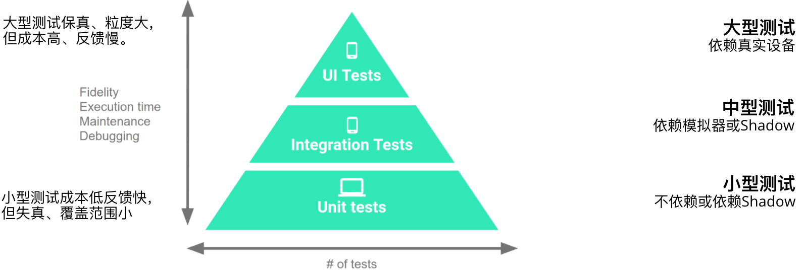
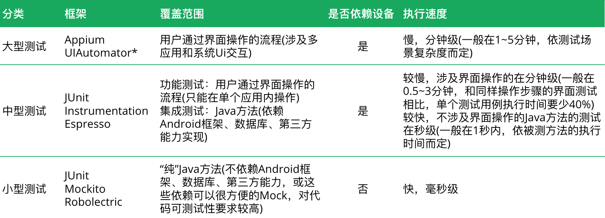
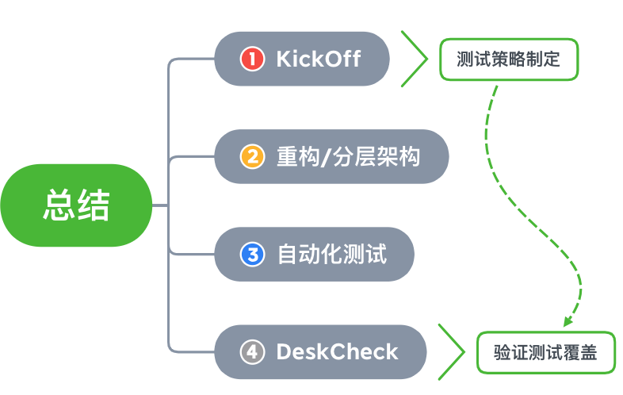

<style>
.container{
    display: flex;
}
.col{
    flex: 1;
}
</style>

<!-- _class: invert -->

# <!--fit--> 遗留代码重构&测试

# 进阶篇：测试策略


CAC@OPPO by 黄俊彬 & 覃宇

---

# <!--fit--> 讨论：项目中做过哪些类型的自动化测试:question:

---

## 自动化测试金字塔（Android）

> 合理设计策略提高自动化测试的ROI



---

## Android自动化测试类型



--- 

## Google 的自动化测试经验

Google 根据自己 APK 开发团队的实践经验，采用测试驱动开发实践，推荐的小、中、大型测试的比例为：**7:2:1** :+1:

> https://developer.android.com/training/testing/fundamentals

## 自动化测试策略的通用原则

单一类型的自动化测试不能做到完全覆盖，要结合运用各种自动化测试。
针对产品的各种形态/阶段的不同侧重点，因地制宜调整各种测试比例。
考虑自动化测试在产品的各种形态/阶段实施成本，最大化投入产出比。

---

# 我们面临的挑战

* 大部分成员没有自动化测试的经验
* 遗留代码很难进行自动化测试，尤其是单元测试
* 自动化测试要做到全覆盖很困难
* 自动化测试需要投入，会影响开发进度

---

# 我们的应对措施

* ~~大部分成员没有自动化测试的经验~~
  10000 小时理论
* ~~遗留代码很难进行自动化测试，尤其是单元测试~~
  重构和测试不分家
* ~~自动化测试要做到全覆盖很困难~~
  选择最具价值的功能进行覆盖
* ~~自动化测试需要投入，会影响开发进度~~
  注重长期收益，合理安排计划

---

# 讨论：典型的 Android 应用如何进行分层测试设计:question:

---

# 典型应用架构 MVP


---

## MVP 优点

1. 复杂的逻辑处理放在presenter进行处理，减少了activity的臃肿。
2. M层与V层完全分离，修改V层不会影响M层，降低了耦合性。
3. 可以将一个Presenter用于多个视图，而不需要改变Presenter的逻辑。
4. P层与V层的交互是通过接口来进行的，便于单元测试。:+1:

## MVP 缺点

1. 视图和Presenter的交互会过于频繁，有时需要定义大量的接口
2. Presenter 对 Activity 与 Fragment 的生命周期是无感知的

---

## MVP 的分层自动化测试策略

<div class="container">
<div class="col">
<b>小型测试</b>
<br/>
<br/>


* Repository
* Presenter :heart:
* Model
</div>

<div class="col">
<b>中型测试</b>
<br/>
<br/>

* Local data source
* Activity
</div>

<div class="col">
<b>大型测试</b>
<br/>
<br/>

* 功能测试
* 性能测试
</div>
</div>

---

# 典型应用架构 MVVM


---

## MVVM 优点

1. ViewModel：因设备配置改变导致 Activity 重建时，无需从 Model 中再次加载数据，减少了 IO 操作
2. LiveData：更新 UI 时，不用再关注生命周期问题
3. Data Binding：可以有效减少模板代码的编写，而且目前已经支持双向绑定

## MVVM 缺点

1. 数据绑定使得Bug很难被调试
2. 数据双向绑定不利于代码重用，不能简单重用View

 
---

## MVVM 分层自动化测试策略

<div class="container">
<div class="col">
<b>小型测试</b>
<br/>
<br/>

* Repository
* ViewModel :heart: 
* Model
</div>

<div class="col">
<b>中型测试</b>
<br/>
<br/>

* Local Data Source
* Service
* Activity
</div>

<div class="col">
<b>大型测试</b>
<br/>
<br/>

* 功能测试
* 性能测试
</div>
</div>

---

# 如何选择应用的架构？

1. 对于偏向展示型的APP，绝大多数业务逻辑都在后端，APP主要功能就是展示数据，交互等，建议使用MVVM。
2. 对于遗留的代码，使用MVP可以更低成本减低代码耦合度及提高可测试性

---

<!-- _class: invert -->

# <!--fit--> &emsp;&emsp;案例展示&emsp;&emsp;

# <!--fit--> 某项目开发新用户故事，使用MVP架构重构，并为Presenter新业务逻辑覆盖单元测试

 ---

 # 用户故事

 ## 动态服务更新后进入应用及时展示出来

 As a : 服务订阅用户
 I want: 有新的服务更新
 So that: 可以第一时间看到动态服务

 **AC1**: 在应用底部
 Given：用户已将列表收起或不存在服务信息
 When：有新的服务
 Then：将列表展示出来（堆叠状态）

// Other AC ...... 

 ---

 # 测试策略制定-KickOff

| 类型   | 内容                                                         | 负责人员  |
|--------|--------------------------------------------------------------|----------|
| 小型测试 | 1、识别判断服务是否更新                                          | 开发人员  |
| 中型测试 | 1、当列表收起时，有新服务，展示列表 <br> 2、当服务为空时，有新服务，展示列表 | 开发人员  |
| 大型测试 | 不覆盖   | 测试工程师 |

### 当AC质量足够高时，按AC作为单元进行分析 :+1:

 
 ---

# 原实现逻辑

```java
class XView extend View{
    private void refreshXXXResult(){
        if(container==null||adapter==null){
            return;
        }
        mAdapter.setCardResults();
        int count=Helper.getAllSceneServiceCount();
        if(sceneCount<1){
            container.setVisibility(GONE);
            if(cardStatus.get()==XXX){
                //do something
            }
            if(cardStatus.get()==YYY){
               //do something
            }
        }else{
            if(serviceView.getVisibility()==GONE){
            // update view state
            }
        }
    }
}
```

---

# 存在问题

* 在自定义View中实现了大部分的业务逻辑，编写新功能时对原有的代码改动大
* 新业务代码和View层耦合，测试编写难度大

---

# 重构-抽取Presenter

```java
class XPresenter{

    XView xView;
    void queryData();
    //关键检查是否有新的服务更新
    public boolean checkIfHasNewServiceCards(){
        boolen hasNewCard=false;
        if(currentCount>lastCount){
            hasNewCard=true;
        }else if(!mLastSceneSet.containtsAll(mCurrentSceneSet)){
            hasNewServiceCards=true;
        }
        //do something ... ...
        return hasNewServiceCards;
    }
}
```

---

# 总结

* 使用MVP模式定义对应的Presenter将业务逻辑与View层剥离（方法抽取、移动）
* 对新增业务方法checkIfHasNewServiceCards编写单元测试 
* XView直接依赖实现，没有按标准的接口定义 :-1:

---

# 单元测试

``` 
class XViewPresenterTest{
    var xPresenter:XPresenter
    var xView=mock(XView::class.java)
    var callBack=mock(CallBack::class.java)

    @Before
    fun setUp{
        xPresenter=XPresenter(xView,callBack)
    }

    @Test
    fun `should return true when checkIfHasNewServiceCards called if have new service cards with last set is empty` (){
        //Given
        val currentList=getElementsList()
        //when
        val result=presenter.checkIfHasNewServiceCards()
        //Then
        Assert.assertTrue(result)
    }

    @Test
    fun `should return false when checkIfHasNewServiceCards called if delete a dervice card` ()

     @Test
    fun `should return false when checkIfHasNewServiceCards called if service card do not change` ()

    // other test case ... ...
}
```

---

# 总结

* 覆盖方法的条件分支
* mock隔离依赖view

---

# DeskCheck

* 展示测试的AC覆盖
* 展示测试的通过率

---



---

# <!--fit--> 有没有对遗留系统进行重构&测试的套路:question:

---

<!-- _class: invert -->

# <!--fit--> 选择恰当时机⏰

> 避免贸然修改代码带来的风险，最大化重构&自动化测试的 ROI。

---

### <!--fit--> :smiley: 合适的时机 &emsp;&emsp;&emsp;&emsp;&emsp;&emsp;&emsp;&emsp;&emsp;&emsp;

* 在对功能扩展和修改时，对原有代码进行重构并加上对**方法**的**小型**测试。
* 在提取可重用的代码块时，为提取出的可复用**代码/模块**加上**小型/中型**测试。
* 在修改遗留代码之前，对覆盖遗留代码的**场景/功能**增加**大型/中型**测试。
* 在修复 Bug 时增加自动化测试保证问题不要再次出现。

---

###  <!--fit--> :unamused: 不合适的时机 &emsp;&emsp;&emsp;&emsp;&emsp;&emsp;&emsp;&emsp;&emsp;&emsp;

* 遗留代码能够满足需要，没有修改的必要（不必浪费增加任何测试）。
* 重写的成本低于重构&自动化测试的成本（重写时及时加上测试）。

---

<!-- _class: invert -->

# <!--fit--> 做好充分准备🎒

---

📖 仔细阅读被测代码、文档、用例，或找其他同事了解，深入理解其功能和实现。
🧰 刻意练习并熟练掌握 IDE 提供的“安全”自动重构功能和一些解依赖的方法。
👬 约上一个同事结对，在重构和编写测试时多一份保障，多一些思路。
🔧 了解不同类型的自动化测试（工具）的目的和实施成本。


---

<!-- _class: invert -->

# <!--fit--> 制定针对性策略🗺️

---

<div class="container">
<div class="col">
<b>确定被测系统 🎯</b>
<br/>
<br/>

* 整机/应用/界面
* 模块/接口
* 类/方法
</div>

<div class="col">
<b>-> 覆盖最有价值的范围 💲</b>
<br/>
<br/>

-> 端到端用户场景
-> 公共接口
-> 核心逻辑/算法
</div>

<div class="col">
<b>-> 考虑实施成本 🔧</b>
<br/>
<br/>

-> 20%大型/80%中小型
-> 中型测试
-> 小型测试
</div>
</div>

<br/>

> 对于遗留系统来说，公共接口的测试覆盖实施成本适中，而端到端用户场景和核心逻辑/算法（一般需要重构，存在风险）实施成本较高

--- 

## 示例：在 Kickoff 时确定的针对性测试策略

| 场景/用例/AC | 大型测试  | 中型测试  | 小型测试  | 手动测试 |
|--------|---|---|---|---|
| 用户使用正确的凭证登录成功 | YES | N/A | N/A | YES |
| 用户使用不正确的凭证登录失败 | YES(用一条路径验证错误提示显示) | N/A | YES（不同的错误消息内容） | YES（抽查） |
| 用户在离线情况下不能登录 | N/A | N/A | N/A | YES |

---

<!-- _class: invert -->

# <!--fit--> 小步重构&测试🐾

# <!--fit--> 1️⃣ **解除耦合** -> 2️⃣ **暴露接缝** -> 3️⃣ **构造依赖** -> 4️⃣ **编写测试** -> 5️⃣ **整理代码**

> 先增加中/大型测试作为安全网，再对核心逻辑/算法重构并增加单元测试。
> 针对一个功能完成上述一轮所有步骤，再进入下一轮。
> 如果无需重构就已经解耦，已经存在接缝，代码已经足够整洁，或者已经有测试且测试通过，可以跳过对应步骤。

---

<!-- _class: invert -->

## <!--fit--> 1️⃣ 解除耦合&nbsp;&nbsp;&nbsp;&nbsp;&nbsp;&nbsp;&nbsp;&nbsp;&nbsp;&nbsp;&nbsp;&nbsp;

> 将被测的场景/模块/代码与其他场景/模块/代码或者其他依赖隔离开

---

<!-- 对方法的改造有：

1.  移动临时变量声明位置。

    **适用情况**：

        临时变量的声明和作用域之间还有其他代码逻辑，不适合作为同一个方法提取

2.  通过提取方法分解过长方法。

    **可以提取成方法的代码片段**：

        - 条件分支
        - 用注释分割的代码段
        - 循环体

3.  通过提取方法消除重复代码。

    **适用情况**：

        同样或者相似的代码逻辑在同一个方法或者同一个类或子类中反复出现。

    **注意事项**：

        往往先要将重复代码中的不同部分通过**提取临时变量**和**提取方法**剥离出去。再使用提取方法将重复的代码逻辑提取成方法。 -->

---

<!-- _class: invert -->

## <!--fit--> 2️⃣ 暴露接缝&nbsp;&nbsp;&nbsp;&nbsp;&nbsp;&nbsp;&nbsp;&nbsp;&nbsp;&nbsp;&nbsp;&nbsp;

> 找出或者通过重构暴露注入依赖的“接缝”

---

> **接缝**是指在不修改代码的条件下，可以改变代码行为的地方。每一个**接缝**都对应着一个**激活点**，**激活点**决定了代码的行为。

---

### 代码中常见的“接缝”和“激活点”

1. 作为依赖被注入的接口或抽象类，通过注入不同的依赖来改变行为，接口的不同实现就是激活点。常见的依赖注入方式：

   - 参数注入
   - 构造方法注入
   - Setter 注入
   - 注入框架（如配置文件）

2. 可以被重写的基类成员，通过子类对基类的重写实现不同的逻辑，子类重写的实现就是激活点。

---

暴露接缝的重构手法有：

1.  提取方法参数

    **适用情况**：

        方法中使用的任何变量都可以使用该手法进行提取。

    **注意事项**：

        * 不能破坏原有方法的签名(一般不会直接修改原方法，而是增加一个新方法)
        * 方法参数过多导致代码可读性下降的坏味道(采用后面其它几种重构方法)

2.  增加带参数的构造方法

    **适用情况**：

        方法依赖的成员变量直接在无参数构造方法中初始化。且成员变量构造困难

3.  使用 Getter 访问成员变量

    **适用情况**：

        方法中直接使用了成员变量，但成员变量不能注入(如在无参构造函数中创建的final成员变量)。测试时可以构造子类重写Getter方法提供返回值。

4.  使用方法代替临时变量

    **适用情况**：

        方法中直接使用了临时变量，构造复杂无法替换(如单例或者静态工厂方法发)。可以将构造逻辑提取成一个成员方法，返回该临时变量。这样子类可以重写该方法返回不同的实例。

---

<!-- _class: invert -->

## <!--fit--> 3️⃣ 构造依赖&nbsp;&nbsp;&nbsp;&nbsp;&nbsp;&nbsp;&nbsp;&nbsp;&nbsp;&nbsp;&nbsp;&nbsp;

> 直接或者通过替身构造依赖并设定依赖的预期行为

---

1. 直接构造依赖对象

    **适用  情况**：

        简单 POJO 对象，有工厂方法，或者 Builder 方法。

2.  使用 Mock

    **适用  情况**：

        非 final 类的对象。如果依赖的使接口或者抽象类，应该 mock 接口或抽象类，而不是 mock 具体实现类。

3.  提取接口或抽象类

    **适用情况**

        被测对象只是使用了依赖的一个或几个方法。可以提取一个接口或者抽象类，将这些方法作为接口方法或者抽象方法。

    **注意事项**

        原来方法的签名可能发生变化(参数类型有由具体类型变为接口或者抽象类)。

4.   增加包装类

    **适用情况**：

        静态工厂方法或者单例构造的依赖。创建一个新的包装类将该依赖包装起来。使方法依赖新的包装类。

    **注意事项**

        原来方法的签名可能发生变化(参数类型变为包装类型)。

---

<!-- _class: invert -->

## <!--fit-->4️⃣ 编写测试&nbsp;&nbsp;&nbsp;&nbsp;&nbsp;&nbsp;&nbsp;&nbsp;&nbsp;&nbsp;&nbsp;&nbsp;

> 创建被测类并注入依赖，对提取出的方法编写单元测试

---

<!-- _class: invert -->

## <!--fit--> 5️⃣ 整理代码&nbsp;&nbsp;&nbsp;&nbsp;&nbsp;&nbsp;&nbsp;&nbsp;&nbsp;&nbsp;&nbsp;&nbsp;

> 对被测试保护起来的代码进行清理，提高代码可读性

---

**改进命名**

**消除重复**


<!-- 1.  重命名

    **适用情况**：

        新方法名、变量名不能表达准确的含义。

    **注意事项**：

        一般不修改原方法的名字(而是给原方法加上 @Deprecated)。

1.  增加注解

    **适用情况**：

        - 决定后续不再使用的方法加上 @Deprecated，并增加注释
        - 增加 ＠NonNull @Nullable 等提示非空或可空的参数

2.   移动方法

    **适用情况**：

        方法中的依赖几乎来自同一个外部对象，该方法和这个对象联系更紧密。

3.  使用方法对象代替方法

    **适用情况**

        方法依赖很多且只有该方法使用。 -->

---

<!-- _class: invert -->

# <!--fit-->&emsp; :secret: 变化 &emsp;

---

### <!--fit-->&emsp;&emsp;&emsp;&emsp; 1. 把变化和不变分开 &emsp;&emsp;&emsp;&emsp;
### <!--fit-->&emsp;&emsp;&emsp;&emsp; 2. 按照预期控制变化 &emsp;&emsp;&emsp;&emsp;
### <!--fit-->&emsp;&emsp;&emsp;&emsp; 3. 在一个维度上变化 &emsp;&emsp;&emsp;&emsp;